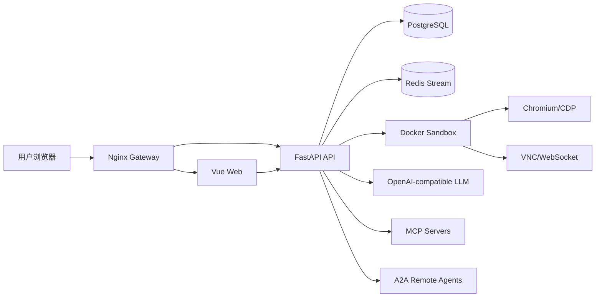
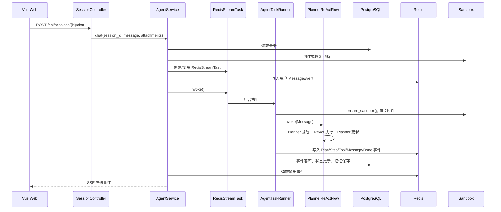

# Agentic 项目架构与实现总结

本文档基于 `agentic` 子项目的当前代码整理，覆盖整体架构、核心执行链、多智能体实现、工具与沙箱、前端事件流、数据持久化和部署方式。

## 1. 项目定位

`agentic` 是一个具备自主执行能力的通用多智能体 Agent 系统，项目中也称为 `MoocManus`。它的核心目标是让用户提交一个任务后，由系统自动规划、调用工具、执行步骤、更新计划、生成结果，并在必要时向用户请求补充输入。

当前实现的自主性主要来自四个机制：

- `PlannerAgent` 将用户目标拆成结构化计划和步骤。
- `ReActAgent` 逐步执行计划，循环进行模型推理和工具调用。
- `PlannerReActFlow` 在每个步骤后回到规划器更新剩余计划。
- `AgentTaskRunner` 管理沙箱、工具、附件同步、事件落库和 SSE 输出。

系统不是单一聊天机器人，而是由本地 Planner、执行 Agent、外部 MCP 工具、远程 A2A Agent、沙箱浏览器和 Shell 共同组成的任务执行系统。

## 2. 顶层服务架构

项目采用前端、后端、沙箱、基础设施分离的架构。

```text
agentic/
├── api/       FastAPI 后端，负责会话、Agent 调度、配置、文件、SSE、VNC 代理
├── web/       Vue 3 + Vite 前端，负责会话 UI、事件流展示、文件/工具/VNC 预览
├── sandbox/   Ubuntu 沙箱服务，提供 Shell、文件、Chrome、VNC 能力
├── nginx/     统一入口网关配置
├── docs/      项目文档
└── docker-compose*.yml
```

生产/容器化部署由 `docker-compose.yml` 编排：

| 服务 | 容器 | 作用 |
| --- | --- | --- |
| Nginx | `manus-nginx` | 对外暴露统一入口，转发 Web 和 API |
| Web | `manus-web` | Vue 前端静态站点 |
| API | `manus-api` | FastAPI 后端服务 |
| PostgreSQL | `manus-postgres` | 会话、事件、文件元数据持久化 |
| Redis | `manus-redis` | Redis Stream 任务输入/输出队列 |
| Sandbox | `manus-sandbox` | 可固定运行，也可作为动态沙箱镜像 |

运行关系如下：



## 3. 后端 API 架构

后端入口是 `agentic/api/app/main.py`，启动时初始化数据库、Redis、对象存储，并把所有控制器挂到 `/api` 前缀下。

当前 API 分层如下：

```text
api/app/
├── controllers/      FastAPI 路由层
├── services/         应用服务层，编排业务流程
├── repositories/     Repository + Unit of Work，隔离数据库访问
├── models/           SQLAlchemy ORM 模型
├── schemas/          API 请求/响应模型
├── core/             Agent、Flow、工具、LLM、沙箱、任务队列等核心能力
├── dependencies/     FastAPI 依赖注入组装
└── extensions/       数据库、Redis、COS/文件存储等基础设施
```

关键控制器：

| 文件 | 主要职责 |
| --- | --- |
| `controllers/session.py` | 创建/删除/停止会话，SSE 聊天流，会话文件读取，VNC WebSocket 代理 |
| `controllers/file.py` | 文件上传、文件信息查询、文件下载 |
| `controllers/app_config.py` | LLM、Agent、MCP、A2A 配置管理 |
| `controllers/health.py` | `/api/status` 健康检查 |

关键服务：

| 文件 | 主要职责 |
| --- | --- |
| `services/session_service.py` | 会话 CRUD、会话文件、沙箱文件/Shell/VNC 读取 |
| `services/agent_service.py` | 创建/复用任务，创建沙箱，接入 Agent 执行并把输出转为 SSE |
| `services/file_service.py` | 上传和下载文件，持久化文件元数据 |
| `services/app_config_service.py` | 基于 YAML 文件读写模型、Agent、MCP、A2A 配置 |

依赖注入集中在 `dependencies/services.py` 和 `dependencies/infrastructure.py`。其中 `get_agent_service()` 会组装 LLM、Agent 配置、MCP 配置、A2A 配置、沙箱类、任务类、JSON 修复解析器、搜索引擎和文件存储。

## 4. 会话与任务执行链路

一次用户任务从前端到后端的主链路如下：



细节实现：

1. 前端调用 `sessionApi.chat()`，它通过 `fetch` 发起 `POST /sessions/{id}/chat` 并解析 SSE。
2. `AgentService.chat()` 校验会话状态；如果没有运行中的任务，调用 `_create_task()`。
3. `_create_task()` 创建或恢复 `DockerSandbox`，从沙箱获取 `PlaywrightBrowser`，再构造 `AgentTaskRunner`。
4. 用户消息被写入 `task.input_stream`，输出事件从 `task.output_stream` 读取。
5. `RedisStreamTask.invoke()` 用 `asyncio.create_task()` 后台运行 `AgentTaskRunner.invoke()`。
6. `AgentTaskRunner` 初始化沙箱、MCP、A2A，运行 `PlannerReActFlow`，把产生的事件写入 Redis 和 PostgreSQL。
7. `AgentService.chat()` 从 Redis 输出流读取事件，转换成 SSE 推送给前端。

这种设计把 HTTP/SSE 长连接和 Agent 后台执行解耦：前端断线后，任务可以继续执行；前端重连时可以通过事件 ID 续读。

## 5. 多智能体核心实现

多智能体主流程在 `core/flows/planner_react.py` 中实现。

### PlannerAgent

文件：`core/agent/planner.py`

职责：

- 基于用户输入生成 `Plan`。
- 每个步骤完成后，根据当前 `Plan` 和已执行 `Step` 更新剩余步骤。
- 输出结构化 JSON，再由 `RepairJSONParser` 修复/解析为 Pydantic 模型。

规划数据结构位于 `core/entities/plan.py`：

- `Plan`：包含 `title`、`goal`、`language`、`steps`、`message`、`status`。
- `Step`：包含 `description`、`status`、`result`、`error`、`success`、`attachments`。

### ReActAgent

文件：`core/agent/react.py`

职责：

- 针对单个步骤执行 ReAct 循环。
- 通过 OpenAI function calling 风格调用工具。
- 把工具结果反馈给 LLM，让模型继续推理，直到生成步骤结果。
- 如果调用 `message_ask_user`，会发出 `WaitEvent`，会话进入 `waiting` 状态。
- 所有步骤完成后调用 `summarize()` 生成最终回复。

### BaseAgent

文件：`core/agent/base.py`

这是 Planner 和 ReAct 的共同基类，负责：

- 加载和保存 Agent 记忆。
- 把工具 schema 注入 LLM。
- 调用 LLM 并处理空响应、重试、工具调用。
- 每次只执行一个工具调用，避免并行工具调用导致上下文难以追踪。
- 将工具调用转换为 `ToolEvent(CALLING/CALLED)`。
- 支持 `compact_memory()` 压缩执行 Agent 上下文。
- 支持 `roll_back()` 修复用户中途输入或人机等待后的消息上下文。

### PlannerReActFlow 状态机

`PlannerReActFlow` 使用 `FlowStatus` 驱动完整任务：

| 状态 | 行为 |
| --- | --- |
| `IDLE` | 新任务进入规划 |
| `PLANNING` | Planner 创建计划，产生 `PlanEvent`、`TitleEvent` 和初始助手消息 |
| `EXECUTING` | ReAct 取下一个未完成步骤并执行 |
| `UPDATING` | Planner 根据步骤结果更新计划 |
| `SUMMARIZING` | ReAct 汇总最终结果 |
| `COMPLETED` | 发送完成的 Plan 和 `DoneEvent` |

这个状态机体现了项目的自主性：Agent 不是一次性回答，而是循环规划、执行、反馈、再规划。

## 6. 事件模型与前端呈现

后端内部事件定义在 `core/entities/event.py`，API SSE 映射在 `schemas/event.py`。

核心事件类型：

| 事件 | 用途 |
| --- | --- |
| `MessageEvent` | 用户消息或助手消息 |
| `PlanEvent` | 计划创建、更新、完成 |
| `StepEvent` | 步骤开始、完成、失败 |
| `ToolEvent` | 工具调用开始和结束 |
| `WaitEvent` | Agent 等待用户输入 |
| `ErrorEvent` | 执行错误 |
| `DoneEvent` | 本轮任务结束 |
| `TitleEvent` | 更新会话标题 |

前端在 `web/src/composables/useSessionDetail.ts` 中维护会话详情、事件数组和流式状态。事件转换集中在 `web/src/lib/session-events.ts`：

- `normalizeEvents()` 把历史事件转换为统一 SSE 结构。
- `eventsToTimeline()` 把原始事件转换成聊天时间线。
- `getLatestPlanFromEvents()` 提取最新 Plan 给 `PlanPanel` 展示。

前端会展示：

- 用户/助手消息。
- 当前计划和步骤。
- 工具调用卡片。
- 文件预览。
- 工具结果预览。
- 沙箱 VNC 桌面。

## 7. 工具系统

工具基类在 `core/tools/base.py`。

实现方式：

- 使用 `@tool(...)` 装饰器声明 OpenAI function calling schema。
- `BaseTool.get_tools()` 收集工具 schema。
- `BaseTool.invoke()` 根据工具名找到对应方法，并过滤多余参数。
- `BaseAgent` 把所有可用工具 schema 传给 LLM，并把 LLM 生成的工具调用路由到对应工具包。

内置工具包：

| 工具包 | 文件 | 能力 |
| --- | --- | --- |
| `FileTool` | `core/tools/file.py` | 读写、替换、搜索、查找沙箱文件 |
| `ShellTool` | `core/tools/shell.py` | 执行命令、读取输出、等待进程、写入交互输入、终止进程 |
| `BrowserTool` | `core/tools/browser.py` | 浏览器查看、导航、点击、输入、滚动、控制台执行 |
| `SearchTool` | `core/tools/search.py` | Bing 搜索 |
| `MessageTool` | `core/tools/message.py` | 通知用户、请求用户补充输入 |
| `MCPTool` | `core/tools/mcp.py` | 接入外部 MCP 工具服务 |
| `A2ATool` | `core/tools/a2a.py` | 调用远程 A2A Agent |

工具事件会被 `AgentTaskRunner._handle_tool_event()` 二次加工，补充前端友好的 `tool_content`。例如：

- 浏览器工具补充截图 URL。
- 搜索工具补充搜索结果列表。
- Shell 工具补充控制台记录。
- 文件工具补充文件内容并同步到对象存储。
- MCP/A2A 工具补充远程调用结果。

## 8. MCP 与 A2A 扩展

### MCP

`MCPTool` 通过 `MCPClientManager` 管理多个 MCP 服务。支持三类传输：

- `stdio`
- `sse`
- `streamable_http`

初始化时会连接 MCP Server，缓存 `ClientSession` 和工具 schema，并把工具名改写成 `mcp_{server_name}_{tool_name}`，避免不同服务之间重名。

调用链：

```text
LLM tool_call -> BaseAgent -> MCPTool.invoke()
-> MCPClientManager.invoke() -> ClientSession.call_tool()
```

### A2A

`A2ATool` 通过 `A2AClientManager` 管理远程 Agent：

- 初始化时访问 `/.well-known/agent-card.json` 获取 Agent Card。
- `get_remote_agent_cards` 把可调用 Agent 暴露给 LLM。
- `call_remote_agent` 通过 JSON-RPC `message/send` 调用远程 Agent。

这使系统可以把复杂任务分派给其他专业 Agent，是项目“多智能体”的外部扩展点。

注意：当前代码中 `enabled` 字段主要用于配置管理和前端展示；执行路径里未看到统一过滤已禁用 MCP/A2A 的逻辑。若禁用语义必须严格生效，建议在 `get_agent_service()` 或配置仓库加载阶段过滤。

## 9. 沙箱架构

沙箱 API 位于 `agentic/sandbox`，后端通过 `core/sandbox/docker_sandbox.py` 访问。

沙箱容器内由 Supervisor 管理多个进程：

| 进程 | 端口 | 作用 |
| --- | --- | --- |
| FastAPI | `8080` | 文件、Shell、Supervisor API |
| Chromium | `8222` | 浏览器实例 |
| socat | `9222` | Chrome DevTools Protocol 代理 |
| Xvfb | - | 虚拟显示器 |
| x11vnc | `5900` | VNC RFB |
| websockify | `5901` | WebSocket VNC |

API 后端的 `DockerSandbox` 支持两种模式：

- `SANDBOX_ADDRESS` 有值：连接固定沙箱服务。
- `SANDBOX_ADDRESS` 为空：通过 Docker SDK 动态创建沙箱容器。

动态创建时会：

- 使用 `SANDBOX_IMAGE` 镜像。
- 按 `SANDBOX_NAME_PREFIX` 生成容器名。
- 将 API、CDP、VNC 端口映射到宿主机或容器网络。
- 注入沙箱超时、Chrome 参数、代理等环境变量。

沙箱提供的能力：

- 文件：读、写、替换、搜索、查找、上传、下载、删除。
- Shell：异步执行命令，保存输出，支持进程等待、输入、终止。
- 浏览器：API 侧通过 Playwright CDP 连接沙箱 Chromium。
- VNC：API `/api/sessions/{id}/vnc` 把前端 WebSocket 代理到沙箱 `5901`。
- 生命周期：Supervisor 可设置超时自动关闭，并在请求时自动延长存活时间。

## 10. 数据持久化

### PostgreSQL

主要 ORM 模型：

| 模型 | 表 | 内容 |
| --- | --- | --- |
| `SessionModel` | `sessions` | 会话状态、沙箱 ID、任务 ID、标题、最新消息、事件、文件、Agent 记忆 |
| `FileModel` | `files` | 文件元数据、对象存储 key、扩展名、MIME、大小 |

`sessions` 表大量使用 JSONB：

- `events` 保存完整事件时间线。
- `files` 保存会话关联文件。
- `memories` 保存不同 Agent 的模型上下文记忆，例如 `planner` 和 `react`。

数据库访问由 `DBUnitOfWork` 管理。`DBUnitOfWork.__aexit__()` 使用 `asyncio.shield()` 尽量保证 commit/rollback/close 不被 SSE 取消作用域中断。

### Redis

任务队列位于 `core/task/redis_stream_task.py` 和 `core/message_queue/redis_stream_message_queue.py`。

每个任务创建两条 Redis Stream：

- `task:input:{task_id}`：用户消息输入。
- `task:output:{task_id}`：Agent 事件输出。

`RedisStreamTask` 还维护一个进程内 `_task_registry`，用于根据 `task_id` 找回运行中的任务。因为 registry 是进程内内存结构，所以当前实现更适合单 API 进程；如果要水平扩容，需要重新设计任务注册、调度和恢复机制。

### 文件存储

文件存储接口在 `extensions/file_storage.py`，当前实现为 `CosFileStorage`。用户上传文件先进入对象存储和文件元数据，再在执行任务时由 `AgentTaskRunner` 同步到沙箱 `/home/ubuntu/upload/`。

Agent 在沙箱中生成的文件会被 `_sync_file_to_storage()` 下载回对象存储，并关联到会话文件列表。

## 11. 前端架构

前端位于 `agentic/web`，技术栈：

- Vue 3
- Vite
- Pinia
- Element Plus
- lucide-vue-next
- markdown-it
- noVNC

关键模块：

| 文件/目录 | 作用 |
| --- | --- |
| `src/App.vue` | 应用壳、侧边栏、设置弹窗、会话流启动 |
| `src/router/index.ts` | `/` 和 `/sessions/:id` 路由 |
| `src/stores/sessions.ts` | 会话列表状态，连接 `/sessions/stream` |
| `src/composables/useSessionDetail.ts` | 会话详情、聊天 SSE、空流续连、事件去重 |
| `src/lib/api/*` | REST/SSE API 封装 |
| `src/lib/session-events.ts` | 后端事件转聊天时间线 |
| `src/components/SessionDetailView.vue` | 主工作区：聊天、计划、工具、文件、VNC |
| `src/components/chat/*` | 消息、思考、计划、工具调用等组件 |
| `src/components/VNCViewer.vue` | noVNC 客户端 |
| `src/components/SettingsModal.vue` | LLM、Agent、MCP、A2A 配置管理 |

前端事件处理有两个流：

- 会话列表流：`POST /api/sessions/stream`，周期性刷新会话列表。
- 会话聊天流：`POST /api/sessions/{id}/chat`，接收当前任务事件。

`useSessionDetail` 在没有新消息但会话未完成时会启动“空消息流”，用于持续监听已有任务输出，避免刷新或断线后错过事件。

## 12. API 摘要

会话：

| 方法 | 路径 | 说明 |
| --- | --- | --- |
| `POST` | `/api/sessions` | 创建会话 |
| `GET` | `/api/sessions` | 获取会话列表 |
| `POST` | `/api/sessions/stream` | SSE 获取会话列表 |
| `GET` | `/api/sessions/{id}` | 获取会话详情 |
| `POST` | `/api/sessions/{id}/chat` | SSE 聊天/任务执行 |
| `POST` | `/api/sessions/{id}/stop` | 停止任务 |
| `POST` | `/api/sessions/{id}/delete` | 删除会话 |
| `GET` | `/api/sessions/{id}/files` | 获取会话文件 |
| `POST` | `/api/sessions/{id}/file` | 读取沙箱文件 |
| `POST` | `/api/sessions/{id}/shell` | 读取沙箱 Shell 输出 |
| `WS` | `/api/sessions/{id}/vnc` | VNC WebSocket 代理 |

配置：

| 方法 | 路径 | 说明 |
| --- | --- | --- |
| `GET/POST` | `/api/app-config/llm` | 获取/更新 LLM 配置 |
| `GET/POST` | `/api/app-config/agent` | 获取/更新 Agent 配置 |
| `GET/POST` | `/api/app-config/mcp-servers` | 获取/新增 MCP 服务 |
| `POST` | `/api/app-config/mcp-servers/{server}/delete` | 删除 MCP 服务 |
| `POST` | `/api/app-config/mcp-servers/{server}/enabled` | 启停 MCP 服务 |
| `GET/POST` | `/api/app-config/a2a-servers` | 获取/新增 A2A 服务 |
| `POST` | `/api/app-config/a2a-servers/{id}/delete` | 删除 A2A 服务 |
| `POST` | `/api/app-config/a2a-servers/{id}/enabled` | 启停 A2A 服务 |

文件：

| 方法 | 路径 | 说明 |
| --- | --- | --- |
| `POST` | `/api/files` | 上传文件 |
| `GET` | `/api/files/{file_id}` | 获取文件信息 |
| `GET` | `/api/files/{file_id}/download` | 下载文件 |

## 13. 部署与本地开发

完整容器部署：

```bash
cd agentic
docker compose up -d --build
```

本地开发常用方式是只用 Docker 启动中间件，本机启动 API 和 Web：

```bash
cd agentic
docker compose -f docker-compose.yml -f docker-compose.dev.yml up -d manus-redis manus-postgres
docker compose build manus-sandbox
```

API：

```bash
cd agentic/api
uv run alembic upgrade head
uv run uvicorn app.main:app --host 0.0.0.0 --port 8000 --reload
```

Web：

```bash
cd agentic/web
pnpm install
pnpm dev
```

默认访问：

- Web：`http://localhost:5173`
- API 文档：`http://localhost:8000/docs`
- 健康检查：`http://localhost:8000/api/status`

## 14. 当前实现特点与注意点

实现特点：

- 多 Agent 协作清晰：Planner 负责拆解和调整计划，ReAct 负责工具执行和总结。
- 事件驱动 UI 完整：计划、步骤、工具、消息、等待和错误均可实时展示。
- 沙箱隔离度较高：Shell、文件、浏览器、VNC 都在独立容器中运行。
- 工具扩展统一：内置工具、MCP 工具和 A2A Agent 都以 tool schema 暴露给 LLM。
- 任务执行和前端连接解耦：Redis Stream 让 SSE 重连和任务后台执行更容易处理。

需要注意：

- `api/config.yaml` 目前用于保存 LLM、MCP、A2A 配置，实际部署不要提交明文密钥，建议改为环境变量或密钥管理服务注入。
- `RedisStreamTask._task_registry` 是进程内注册表，API 多进程或多副本部署时无法共享运行中任务状态。
- MCP/A2A 的 `enabled` 字段当前主要服务于 UI 和配置记录，执行前过滤逻辑需要进一步确认或补齐。
- 沙箱动态创建依赖 Docker Socket，容器化部署时要谨慎控制 `/var/run/docker.sock` 权限。
- LLM 调用使用 OpenAI 兼容接口，模型需要支持 JSON 输出和工具调用，否则 Planner/ReAct 的稳定性会下降。

## 15. 一句话总结

`agentic` 的核心是一个 `PlannerAgent + ReActAgent` 的自主任务执行流：用户发起目标后，后端创建沙箱和 Redis 任务，Planner 生成计划，ReAct 按步骤调用文件、Shell、浏览器、搜索、MCP、A2A 等工具执行，执行过程以事件形式持久化并通过 SSE 推送给 Vue 前端，最终形成可观察、可中断、可继续的人机协同 Agent 系统。
