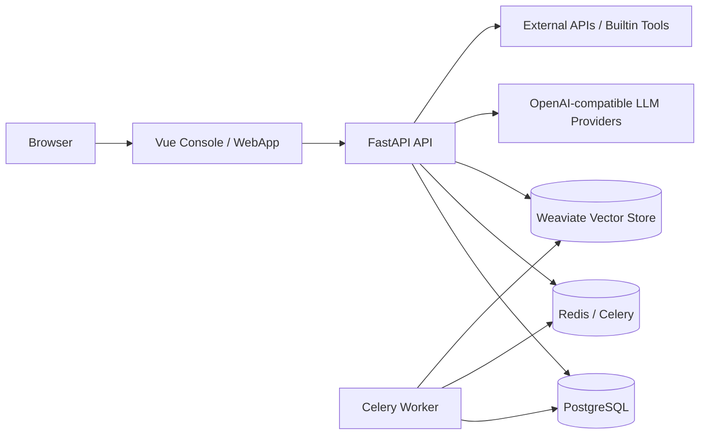
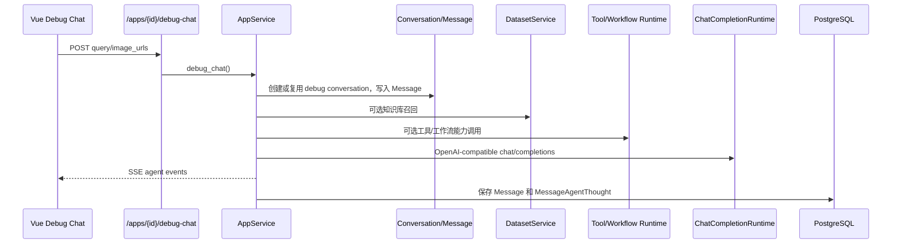
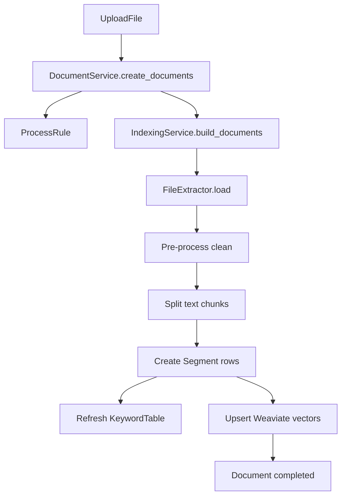

# LLMOps 项目架构与实现总结

本文档基于 `llmops` 子项目当前代码整理，覆盖项目定位、整体架构、后端分层、Agent 应用运行链路、工具系统、工作流系统、知识库检索、Router/Worker Agent 平台化能力、前端实现、数据持久化与部署方式。

## 1. 项目定位

`llmops` 是一个 Agent 应用开发与发布平台。它的核心不是像 `agentic` 那样让一个自主 Agent 自动拆解并执行任意任务，而是提供一套可视化平台能力，让用户配置和发布可复用的 Agent 应用。

平台的主要资产包括：

- `App`：面向用户的 Agent 应用，包含模型、人设提示词、工具、工作流、知识库、记忆、审核、语音等能力配置。
- `Workflow`：可视化工作流，使用节点和连线编排 LLM、工具、HTTP、代码、知识库检索等步骤。
- `Tool`：内置工具和自定义 API 工具，可作为 App 能力，也可被工作流调用。
- `Dataset`：知识库，支持文档上传、切片、索引、召回，并可绑定到 App 或工作流。
- `Publishing`：应用可发布为 WebApp、OpenAPI、微信接入等渠道。
- `Router/Worker Agent`：平台化的 Agent 抽象，用于把 App 转换为 Worker Agent，并由 Router Agent 生成计划和调度 Worker。

一句话概括：`llmops` 是 Agent 平台，核心是“配置、编排、调试、发布、观测”，不是一个完全自主的通用任务执行 Agent。

## 2. 顶层架构

```text
llmops/
├── api/      FastAPI 后端，负责平台 API、Agent 运行、工作流、工具、知识库、发布渠道
├── ui/       Vue 3 + Vite 前端，负责 Console、工作流画布、应用配置、调试聊天、发布页面
├── docker/   Docker Compose、Nginx、PostgreSQL、Redis、Weaviate 等部署配置
├── docs/     项目文档
├── README.md
└── CLAUDE.md
```

容器化部署由 `llmops/docker/docker-compose.yaml` 编排：

| 服务 | 作用 | 默认端口 |
| --- | --- | --- |
| `llmops-ui` | Vue 前端开发/运行服务 | `3000` |
| `llmops-api` | FastAPI API 服务 | 宿主 `5011` -> 容器 `5001` |
| `llmops-celery` | Celery 后台任务 worker | 无对外端口 |
| `llmops-db` | PostgreSQL 主数据库 | `5432` |
| `llmops-redis` | Redis，供 Celery broker/result backend 使用 | `6379` |
| `llmops-weaviate` | Weaviate 向量检索服务 | `8080`, `50051` |
| `llmops-nginx` | 可选边缘网关，位于 `edge` profile | `80`, `443` |



## 3. 后端分层

后端入口是 `llmops/api/app/main.py`，调用 `create_app()` 创建 FastAPI 应用。`app_factory.py` 在 lifespan 中初始化数据库和 Redis，并注册中间件、异常处理和路由。

后端主要分层：

```text
api/app/
├── api/
│   ├── router.py        路由集中注册
│   ├── deps.py          FastAPI 依赖注入、认证、Service 工厂
│   └── routers/         各业务路由
├── services/            业务服务层，承接主要应用逻辑
├── models/              SQLAlchemy ORM 模型
├── schemas/             Pydantic 请求/响应模型
├── core/                LLM、Workflow、Agent、Tools、Dataset 等核心实体与运行逻辑
├── domain/agent_runtime Router/Worker Agent 协议与运行时抽象
├── infrastructure/      DB、Redis、Celery、Vector Store、文件存储等基础设施
├── tasks/               Celery 任务定义
└── shared/              统一响应、分页、密码等通用组件
```

路由全部在 `api/router.py` 注册，覆盖 `apps`、`workflows`、`datasets`、`documents`、`segments`、`api-tools`、`builtin-tools`、`language-models`、`openapi`、`web-apps`、`router-agents`、`assistant-agent`、`analysis`、`trace` 等模块。

统一响应格式位于 `shared/response/response.py`：

```json
{
  "code": "success",
  "message": "",
  "data": {}
}
```

流式接口使用 `StreamingResponse`，媒体类型为 `text/event-stream`，由 `compact_generate_response()` 自动区分普通响应与 SSE generator。

## 4. 认证与租户

当前平台主要有三类调用身份：

- Console 用户：通过 `/auth/password-login` 获取 JWT，后续请求使用 `Authorization: Bearer <token>`。
- OpenAPI 调用方：通过 `X-API-Key` 访问 `/openapi/chat`。
- Router/Worker 平台能力：部分接口通过 `X-Tenant-ID`、`X-User-ID` 注入租户上下文。

核心依赖位于 `api/deps.py`：

- `get_current_account()`：解析 Bearer Token 并加载 `Account`。
- `get_api_key_account()`：解析 `X-API-Key` 并加载归属账号。
- `get_current_tenant()`：解析租户上下文。
- `get_current_member()`：校验租户成员身份。

相关模型包括：

| 模型 | 作用 |
| --- | --- |
| `Account` | 控制台账号、密码、头像、最近登录信息、Assistant Agent 会话 |
| `ApiKey` | OpenAPI 访问凭证 |
| `Tenant` / `TenantMember` | Router/Worker Agent 平台化租户与成员上下文 |

## 5. App Agent 应用

`App` 是平台最核心的产品对象。用户在控制台创建 App 后，可以配置模型、人设提示词、工具、工作流、知识库、长期记忆、开场白、建议问题、语音输入输出和审核策略。

主要模型：

| 模型 | 说明 |
| --- | --- |
| `App` | 应用基础信息、状态、发布配置引用、草稿配置引用、WebApp token |
| `AppConfigVersion` | 草稿和历史发布版本，保存完整应用配置 |
| `AppConfig` | 当前发布版本配置 |
| `AppDatasetJoin` | 已发布 App 与 Dataset 的关联 |

App 配置默认值来自 `Settings.default_app_config`，主要字段包括：

- `model_config`
- `dialog_round`
- `preset_prompt`
- `tools`
- `workflows`
- `datasets`
- `retrieval_config`
- `long_term_memory`
- `opening_statement`
- `opening_questions`
- `speech_to_text`
- `text_to_speech`
- `suggested_after_answer`
- `review_config`

### 5.1 草稿、调试、发布

`AppService` 维护 App 的完整生命周期：

1. `create_app()` 创建 App 和草稿配置。
2. `update_draft_app_config()` 校验并保存草稿配置。
3. `debug_chat()` 使用草稿配置进行调试对话，结果通过 SSE 返回。
4. `publish_draft_app_config()` 将草稿配置固化为 `AppConfig`，并写入发布历史。
5. `cancel_publish_app_config()` 取消发布。
6. `fallback_history_to_draft()` 将历史版本回滚到草稿。

App 发布后，可通过 WebApp、OpenAPI、微信等渠道调用。

### 5.2 App 调试运行链路

调试入口是 `/apps/{app_id}/debug-chat`，核心执行在 `AppService._run_debug_agent()`。



执行过程：

- 如果启用长期记忆，先从会话 summary 中召回并输出 `long_term_memory_recall` 事件。
- 如果绑定知识库，先执行检索并输出 `dataset_retrieval` 事件。
- 如果输入审核命中关键词，直接返回预设回复。
- 加载模型配置，读取历史消息，构建 system prompt。
- 将工具、工作流、知识库转换为 runtime capabilities。
- 如果模型支持工具调用或 Agent Thought，则进入最多 5 轮的迭代式能力调用。
- 如果模型不支持迭代能力，则先执行已配置工具/工作流，把结果作为上下文交给模型。
- 最终回答按 chunk 输出 `agent_message`，结束时输出 `agent_end`。

SSE 事件类型定义在 `core/agent/entities.py`：

| 事件 | 说明 |
| --- | --- |
| `long_term_memory_recall` | 长期记忆召回 |
| `dataset_retrieval` | 知识库召回 |
| `agent_thought` | 模型产生工具调用或推理动作 |
| `agent_action` | 工具、工作流等能力执行 |
| `agent_message` | 最终回答分片 |
| `agent_end` | 本轮结束 |
| `stop` | 用户停止 |
| `error` | 运行错误 |
| `timeout` | 超时 |
| `ping` | 心跳 |

`AgentQueueManager` 当前是进程内任务停止标记和任务归属表，用于调试对话、WebApp 对话和 Assistant Agent 对话的停止控制。

## 6. 工作流系统

工作流由 `WorkflowService` 实现，是平台的可视化编排核心。前端使用 Vue Flow 画布编辑节点和连线，后端保存为 JSONB 图结构。

主要模型：

| 模型 | 说明 |
| --- | --- |
| `Workflow` | 工作流基础信息、草稿图、发布图、调试状态、发布时间 |
| `WorkflowResult` | 每次调试执行的图、节点状态、耗时和结果 |

`Workflow` 有两个图：

- `draft_graph`：前端正在编辑的草稿图。
- `graph`：发布后的稳定图，只能由通过调试的草稿发布得到。

### 6.1 节点类型

节点类型定义在 `core/workflow/entities.py`：

| 节点 | 作用 |
| --- | --- |
| `start` | 声明工作流输入变量 |
| `llm` | 根据 prompt 和输入变量调用大模型 |
| `tool` | 调用内置工具或自定义 API 工具 |
| `dataset_retrieval` | 从知识库召回内容 |
| `template_transform` | 使用模板渲染变量 |
| `http_request` | 发起外部 HTTP 请求 |
| `code` | 执行受限 Python `main(params)` |
| `end` | 收集最终输出变量 |

### 6.2 前端编辑

工作流编辑页位于 `ui/src/views/space/workflows/DetailView.vue`：

- 使用 `@vue-flow/core` 渲染节点和边。
- 使用 `dagre` 做自动布局。
- 每种节点有独立展示组件和配置面板。
- `use-workflow.ts` 的 `convertGraphToReq()` 将 Vue Flow 节点转换成后端 `draft_graph`。
- 节点拖拽、连线、节点配置更新会调用 `/workflows/{workflow_id}/draft-graph` 保存。

前端会限制一个图里只能添加一个 `start` 和一个 `end`，后端也会再次校验。

### 6.3 后端校验

`WorkflowService.validate_draft_graph()` 做草稿级标准化：

- 过滤非法节点和非法边。
- 规范节点 ID、类型、标题、描述、位置。
- 为不同节点补齐默认字段和输出变量。
- 去重节点、标题、边和 source-target 对。
- 限制 `start`、`end` 各一个。

`validate_publish_graph()` 做发布级校验：

- 必须有节点。
- 必须且只能有一个 `start` 和一个 `end`。
- 多节点图必须有边。
- 必须只有一个入口和一个出口。
- 必须从 start 连通到全部节点。
- 不能有环。
- 变量引用只能引用上游节点。
- 引用变量必须存在于上游节点输出。

### 6.4 执行模型

调试入口是 `/workflows/{workflow_id}/debug`，返回 SSE `workflow` 事件。

执行过程：

1. 创建 `WorkflowResult`，状态为 `running`。
2. 对 `draft_graph` 做发布级校验。
3. 用拓扑排序生成执行批次。
4. 按拓扑顺序执行节点，并把每个节点结果追加到 `node_results`。
5. 每个节点完成后推送一次 `workflow` SSE 事件。
6. 任一节点失败则标记结果失败并停止。
7. 全部成功则标记 `WorkflowResult` 成功，并把 `Workflow.is_debug_passed` 置为 `true`。

注意：当前 `_execution_batches()` 会生成拓扑批次，但调试执行中批次内节点仍是顺序执行，不是并行执行。

各节点执行方式：

- `start`：读取用户输入，按变量类型做简单转换。
- `template_transform`：支持 `{{ name }}` 和 Python `str.format()` 风格渲染。
- `code`：只允许定义一个 `main(params)`，且只暴露少量 builtin。
- `http_request`：使用 `httpx.request()` 发起请求，输出 `status_code` 和 `text`。
- `tool`：根据 `tool_type` 调用内置工具或 API 工具。
- `dataset_retrieval`：调用 `DatasetService.hit()` 召回片段并合并为 `combine_documents`。
- `llm`：加载模型并通过 `ChatCompletionRuntime.complete()` 调用大模型。
- `end`：从上游变量中抽取最终输出。

### 6.5 发布规则

工作流发布要求先通过调试：

```text
update draft_graph -> debug success -> is_debug_passed=true -> publish -> graph=draft_graph
```

发布后，工作流可以作为 App 能力参与 Agent 运行，也可以在 App 的迭代式工具调用中被转换为函数能力。

## 7. 工具系统

工具系统分为内置工具和自定义 API 工具。

### 7.1 内置工具

内置工具定义在 `api/app/core/tools/builtin_tools`：

```text
builtin_tools/
├── providers/
│   ├── providers.yaml
│   ├── time/
│   ├── google/
│   ├── duckduckgo/
│   ├── wikipedia/
│   ├── dalle/
│   └── gaode/
├── categories/
└── runtime.py
```

`BuiltinProviderManager` 从 YAML 加载 provider 和 tool 元数据，`runtime.py` 将工具名称映射到实际运行函数。

当前内置工具包括：

| Provider | 工具 | 能力 |
| --- | --- | --- |
| `time` | `current_time` | 获取当前时间 |
| `gaode` | `gaode_weather` | 高德天气 |
| `google` | `google_serper` | Serper Google 搜索 |
| `duckduckgo` | `duckduckgo_search` | DuckDuckGo 搜索 |
| `wikipedia` | `wikipedia_search` | Wikipedia 摘要查询 |
| `dalle` | `dalle3` | OpenAI 图片生成接口 |

### 7.2 自定义 API 工具

自定义 API 工具由 `ApiToolService` 管理：

- 用户提交简化版 OpenAPI JSON。
- `OpenAPISchema` 校验 `server`、`description`、`paths`、`operationId` 和参数。
- 每个接口操作被保存为一条 `ApiTool`。
- `ApiProviderManager` 运行时用 `httpx.request()` 调用对应接口。

当前 OpenAPI 支持是平台定制的轻量子集：

- 只扫描 `get` 和 `post`。
- 参数支持 `path`、`query`、`header`、`cookie`、`request_body`。
- 参数类型支持 `str`、`int`、`float`、`bool`。
- 运行时会把 provider headers 和工具输入参数合并后发起请求。

### 7.3 工具作为 Agent 能力

`ToolCapabilityAdapter` 会把工具、知识库、工作流转换为统一的 `CapabilityDescriptor`：

- `tool_config_to_descriptor()`：内置工具或 API 工具 -> function schema。
- `workflow_to_descriptor()`：已发布工作流 -> function schema。
- `dataset_collection_to_descriptor()`：知识库集合 -> `dataset_retrieval` function schema。

App 运行时再把这些 descriptor 转成 OpenAI tools schema。如果模型支持原生 tool call，则走 provider tool calling；如果模型只支持 Agent Thought，则通过提示词要求模型输出 fenced JSON，再由后端解析工具调用。

## 8. 知识库与 RAG

知识库由 `DatasetService`、`DocumentService`、`IndexingService` 和 `WeaviateVectorStore` 共同实现。

主要模型：

| 模型 | 说明 |
| --- | --- |
| `Dataset` | 知识库基础信息 |
| `Document` | 上传文档处理状态、字符数、token 数、启停状态 |
| `Segment` | 文档切片、关键词、向量节点 ID、命中次数 |
| `KeywordTable` | 关键词到 Segment 的倒排索引 |
| `DatasetQuery` | 查询记录 |
| `ProcessRule` | 文档清洗和分段规则 |

### 8.1 文档处理链路



`IndexingService` 会：

- 读取上传文件。
- 按规则清理 URL、邮箱、多余空格等内容。
- 按 chunk size 和 overlap 分段。
- 创建 `Segment`。
- 生成关键词表。
- 写入 Weaviate 向量库。
- 更新文档状态为 `completed`。

Celery 中也注册了文档构建、启停、删除等任务，但当前 `DocumentService.create_documents()` 直接调用 `IndexingService().build_documents()`，实际链路是同步执行。后续如果要承载大文件或高并发，建议把索引构建切到 Celery 异步路径。

### 8.2 向量检索

`WeaviateVectorStore` 封装了 Weaviate HTTP API：

- `upsert_segments()`：写入 Segment 向量和元数据。
- `search_segments()`：使用 GraphQL `nearVector` 搜索。
- `update_document_enabled()` / `update_segment_enabled()`：同步启停状态。
- `delete_document()` / `delete_dataset()`：删除向量对象。

Embedding 有两种方式：

- `hash`：默认本地 hash embedding，无外部依赖，适合开发和低成本测试。
- `openai`：通过 OpenAI-compatible embeddings API 生成向量。

### 8.3 召回策略

`DatasetService.hit()` 支持三种主要策略：

| 策略 | 说明 |
| --- | --- |
| `semantic` | 优先使用 Weaviate 向量检索，失败时回退到词法评分 |
| `full_text` | 使用 `KeywordTable` 倒排索引，失败时回退到词法评分 |
| `hybrid` | 关键词结果和向量/词法结果按权重合并 |

召回结果会被用于：

- App 的系统提示词上下文。
- Workflow 的 `dataset_retrieval` 节点。
- App 运行时的 `dataset_retrieval` capability。

## 9. 模型系统

模型元数据定义在 `api/app/core/language_model/providers`，由 `LanguageModelManager` 从 YAML 加载。

当前 provider 目录包含：

- `openai`
- `deepseek`
- `moonshot`
- `tongyi`
- `wenxin`
- `ollama`

模型实体支持：

- `model_type`
- `features`
- `context_window`
- `max_output_tokens`
- 默认参数模板
- pricing metadata

`ChatCompletionRuntime` 使用 OpenAI-compatible `/chat/completions` 接口调用模型。运行时 provider 映射包括：

| Provider | Credential 环境变量 | Base URL 环境变量 |
| --- | --- | --- |
| `openai` | `OPENAI_API_KEY` | `OPENAI_BASE_URL` / `OPENAI_API_BASE` |
| `deepseek` | `DEEPSEEK_API_KEY` | `DEEPSEEK_BASE_URL` |
| `moonshot` | `MOONSHOT_API_KEY` | `MOONSHOT_BASE_URL` |
| `tongyi` | `DASHSCOPE_API_KEY` | `DASHSCOPE_BASE_URL` |
| `ollama` | 无需 API Key | `OLLAMA_BASE_URL` |

模型能力通过 `ModelFeature` 表达：

- `tool_call`
- `agent_thought`
- `image_input`

这直接影响 App Agent 是否能进入工具调用循环。

## 10. Assistant Agent

`AssistantAgentService` 是平台助手，用来帮助用户设计 Agent、工作流、工具、知识库、提示词和集成方案。

实现方式：

- 使用一个固定的 assistant agent id。
- 创建或复用账号上的 assistant conversation。
- 构造一份基于 `DEFAULT_APP_CONFIG` 的运行配置。
- 注入 `create_app` runtime capability。
- 复用 `AppService._run_debug_agent()` 完成对话和工具调用。

也就是说，Assistant Agent 不是单独的一套 Agent 引擎，而是复用了 App Agent 运行链路，只是预设了平台助手 prompt 和创建 App 的能力。

## 11. Router/Worker Agent 平台化抽象

`llmops` 还有一条面向多 Agent 编排的平台化模型，核心在：

```text
api/app/domain/agent_runtime/
api/app/services/router_agent_manager_service.py
api/app/services/task_engine_service.py
api/app/models/agent.py
api/app/models/task.py
```

这部分把 Agent 抽象为两类：

- `router`：Manager Agent，负责选择 Worker 并生成计划。
- `worker`：Worker Agent，当前可由已存在的 App 转换得到。

主要模型：

| 模型 | 说明 |
| --- | --- |
| `Agent` | Router 或 Worker 的主记录 |
| `AgentVersion` | Agent 版本配置，保存 model/prompt/router/worker/capability/policy |
| `AgentBinding` | Router 与 Worker 的绑定关系 |
| `AgentTask` | 一次 Router 运行任务 |
| `AgentPlan` | Router 生成的计划 |
| `AgentStep` | 计划中的 Worker 执行步骤 |
| `WorkerCall` | 一次 Worker 调用记录 |
| `CapabilityCall` | 能力调用记录，预留审批、风险、幂等信息 |

Router manager 流程：

1. `create_router_agent()` 创建 Router Agent。
2. `create_worker_agent_from_app()` 将现有 App 转换为 Worker Agent。
3. `bind_worker()` 绑定 Router 与 Worker。
4. `create_manager_run()` 根据用户输入和已绑定 Worker 构造 `RouterPlan`。
5. `execute_manager_run_steps()` 顺序执行步骤，记录 task、step、worker call、trace。

当前实现的关键边界：

- `RouterRuntime` 主要负责计划校验，例如 step id 去重、worker id 合法、依赖存在、只能调用绑定 worker。
- `WorkerRuntime` 仍是 placeholder，返回 `not_implemented`。
- 实际执行 Worker 时，`RouterAgentManagerService._invoke_worker()` 只支持 `target_ref_type == "app"`，并通过 `AppService.debug_chat()` 复用 App 调试运行链路。
- 当前 manager plan 是规则生成：对选中的 worker 逐个生成同步步骤，并非由 LLM 自主规划。

因此，Router/Worker 这部分已经有平台数据模型和治理外壳，但独立 Worker runtime、审批执行、能力调用审计、异步调度等还属于后续扩展空间。

## 12. 发布与调用渠道

### 12.1 WebApp

WebApp 由 `WebAppService` 实现：

- App 发布后可生成或重新生成 `token`。
- 前端访问 `/web-apps/:token` 进入独立对话页。
- 后端通过 token 找到已发布 App。
- 对话复用 `AppService._run_debug_agent()`，但使用发布配置。

相关接口：

| 方法 | 路径 | 说明 |
| --- | --- | --- |
| `GET` | `/web-apps/{token}` | 获取 WebApp 信息 |
| `POST` | `/web-apps/{token}/chat` | WebApp SSE 对话 |
| `POST` | `/web-apps/{token}/stop/{task_id}` | 停止对话 |
| `GET` | `/web-apps/{token}/conversations` | 会话列表 |

### 12.2 OpenAPI

OpenAPI 由 `OpenAPIService` 实现，使用 `X-API-Key` 认证。

调用 `/openapi/chat` 时：

- 校验 API Key 并拿到账号。
- 根据 `app_id` 找到已发布 App。
- 创建或复用 end user 和 service api conversation。
- 根据 `stream` 决定返回 SSE 或一次性 JSON。
- 运行时仍复用 App Agent 执行链路。

### 12.3 微信

前端发布页中提供微信公众账号配置入口，后端有 `wechat` 和 `platform` 相关服务与路由。当前文档只从架构层面记录其作为发布渠道存在，具体消息签名、回调和微信平台交互逻辑需结合 `wechat_service.py` 继续展开。

## 13. 前端架构

前端位于 `llmops/ui`，技术栈：

- Vue 3
- Vite
- TypeScript
- Element Plus
- Pinia
- Vue Flow
- dagre
- ECharts
- markdown-it
- highlight.js
- js-audio-recorder
- vue-virtual-scroller
- Tailwind CSS

主要目录：

```text
ui/src/
├── router/       路由
├── stores/       Pinia 状态
├── services/     API 请求封装
├── hooks/        业务组合函数
├── models/       TypeScript 请求/响应模型
├── utils/        request、auth、storage、confirm 等工具
├── components/   通用消息、思考过程、图标、Markdown 等组件
└── views/        页面
```

核心页面：

| 页面 | 说明 |
| --- | --- |
| `/home` | 首页 |
| `/space/apps` | App 列表 |
| `/space/apps/:app_id` | App 编排与调试 |
| `/space/apps/:app_id/published` | App 发布渠道 |
| `/space/workflows` | Workflow 列表 |
| `/space/workflows/:workflow_id` | Workflow 可视化编辑器 |
| `/space/tools` | 自定义工具 |
| `/space/datasets` | 知识库 |
| `/openapi` | OpenAPI 使用说明 |
| `/openapi/api-keys` | API Key 管理 |
| `/store/apps` / `/store/tools` | 内置应用和工具市场 |
| `/web-apps/:token` | 独立 WebApp 对话页 |

### 13.1 请求封装

`ui/src/utils/request.ts` 封装了：

- 普通 JSON 请求。
- 自动注入 Bearer token。
- 统一处理 `success`、`unauthorized`、`not_found`、`forbidden` 等业务码。
- `ssePost()` 解析 `event:` 和 `data:` 格式的 SSE。
- 文件上传 XHR。

### 13.2 App 配置页

`views/space/apps/DetailView.vue` 是 App 编排页：

- 左侧配置模型、人设 prompt 和能力。
- 右侧 Preview Debug Chat 进行实时调试。
- 能力组件包括工具、工作流、知识库、长期记忆、开场白、建议问题、语音输入、语音输出、审核策略。

调试聊天组件 `PreviewDebugChat.vue`：

- 发送文本和图片。
- 接收 SSE。
- 显示人类消息、AI 消息和 agent thoughts。
- 支持停止任务。
- 支持语音转文字、文本转语音和建议问题生成。

### 13.3 Workflow 编辑器

`views/space/workflows/DetailView.vue` 是工作流画布：

- 使用 Vue Flow 显示节点和连线。
- 使用 `NODE_DATA_MAP` 定义节点默认配置。
- 支持节点新增、删除、拖拽、连线、自动布局、缩放。
- 节点配置面板分布在 `components/infos`。
- 节点展示组件分布在 `components/nodes`。
- 调试弹窗位于 `DebugModal.vue`。

## 14. 数据持久化

PostgreSQL 是主存储。关键表可以按领域归类：

| 领域 | 主要表 |
| --- | --- |
| 账号与认证 | `account`, `account_oauth`, `api_key`, `tenants`, `tenant_members` |
| App | `app`, `app_config`, `app_config_version`, `app_dataset_join` |
| 对话 | `conversation`, `message`, `message_agent_thought`, `end_user` |
| Workflow | `workflow`, `workflow_result` |
| Tool | `api_tool_provider`, `api_tool` |
| Dataset | `dataset`, `document`, `segment`, `keyword_table`, `dataset_query`, `process_rule` |
| Router/Worker Agent | `agents`, `agent_versions`, `agent_bindings` |
| Task Engine | `agent_tasks`, `agent_plans`, `agent_steps`, `worker_calls`, `capability_calls` |
| 审批与追踪 | `approval`, `trace` |
| 文件 | `upload_file` |

Redis 主要用于 Celery broker 和 result backend。Agent 对话停止控制当前使用进程内内存结构，不是 Redis 分布式状态。

Weaviate 用于知识库向量索引，默认集合名为 `Dataset`。

## 15. API 摘要

App：

| 方法 | 路径 | 说明 |
| --- | --- | --- |
| `POST` | `/apps` | 创建 App |
| `GET` | `/apps` | App 分页列表 |
| `GET` | `/apps/{app_id}` | App 详情 |
| `GET/POST/PUT` | `/apps/{app_id}/draft-app-config` | 草稿配置读取和保存 |
| `POST` | `/apps/{app_id}/debug-chat` | 调试聊天 SSE |
| `POST` | `/apps/{app_id}/stop-debug-chat/{task_id}` | 停止调试聊天 |
| `POST` | `/apps/{app_id}/publish` | 发布 App |
| `POST` | `/apps/{app_id}/cancel-publish` | 取消发布 |
| `GET` | `/apps/{app_id}/publish-histories` | 发布历史 |
| `POST` | `/apps/{app_id}/fallback-history` | 历史版本回滚到草稿 |

Workflow：

| 方法 | 路径 | 说明 |
| --- | --- | --- |
| `POST` | `/workflows` | 创建工作流 |
| `GET` | `/workflows` | 工作流分页列表 |
| `GET` | `/workflows/{workflow_id}` | 工作流详情 |
| `GET/PUT` | `/workflows/{workflow_id}/draft-graph` | 读取/保存草稿图 |
| `POST` | `/workflows/{workflow_id}/debug` | 工作流调试 SSE |
| `POST` | `/workflows/{workflow_id}/publish` | 发布工作流 |
| `POST` | `/workflows/{workflow_id}/cancel-publish` | 取消发布 |

Tool 和 Dataset：

| 方法 | 路径 | 说明 |
| --- | --- | --- |
| `GET` | `/builtin-tools` | 内置工具列表 |
| `GET` | `/builtin-tools/{provider}/{tool}` | 内置工具详情 |
| `POST` | `/api-tools` | 创建 API 工具 provider |
| `GET` | `/api-tools` | API 工具 provider 列表 |
| `POST` | `/datasets` | 创建知识库 |
| `GET` | `/datasets` | 知识库列表 |
| `POST` | `/datasets/{dataset_id}/documents` | 创建文档并索引 |
| `GET` | `/datasets/{dataset_id}/documents` | 文档列表 |
| `GET` | `/datasets/{dataset_id}/documents/{document_id}/segments` | 文档切片列表 |

发布渠道：

| 方法 | 路径 | 说明 |
| --- | --- | --- |
| `GET` | `/web-apps/{token}` | WebApp 信息 |
| `POST` | `/web-apps/{token}/chat` | WebApp 对话 |
| `POST` | `/openapi/chat` | API Key 调用已发布 App |

Router/Worker Agent：

| 方法 | 路径 | 说明 |
| --- | --- | --- |
| `POST` | `/router-agents` | 创建 Router Agent |
| `POST` | `/router-agents/workers/from-app` | 从 App 创建 Worker Agent |
| `POST` | `/router-agents/{router_agent_id}/workers` | 绑定 Worker |
| `POST` | `/router-agents/{router_agent_id}/manager-runs` | 创建 Manager Run，可选立即执行 |

## 16. 部署与开发

推荐容器化启动：

```bash
cd llmops/docker
cp .env.example .env
docker compose up -d --build
```

默认访问：

- UI: `http://localhost:3000`
- API: `http://localhost:5011`
- PostgreSQL: `localhost:5432`
- Redis: `localhost:6379`
- Weaviate HTTP: `localhost:8080`

API 本地开发常用命令：

```bash
cd llmops/api
uv run alembic upgrade head
uv run uvicorn app.main:app --host 0.0.0.0 --port 5011 --reload
```

前端本地开发：

```bash
cd llmops/ui
pnpm install
pnpm dev
```

配置注意：

- 真实密钥应写入 `docker/.env` 或部署环境变量，不要提交到仓库。
- LLM provider、embedding provider、Weaviate、文件存储、OAuth、工具 API key 都通过环境变量配置。
- 本地文件存储默认使用 `FILE_STORAGE_TYPE=local`，也支持 COS 相关配置。

## 17. 当前实现特点与注意事项

实现特点：

- 平台核心清晰：App、Workflow、Tool、Dataset 四类资产构成主要能力面。
- App 运行链路复用度高：Debug、WebApp、OpenAPI、Assistant Agent 都复用 `AppService._run_debug_agent()`。
- 工具和工作流可统一为 capability schema，被模型以 tool calling 或 ReAct JSON 方式调用。
- 工作流实现是轻量 DAG 引擎，校验、执行、调试、发布闭环完整。
- 知识库实现包含文档处理、关键词表、向量库、混合召回和 App/Workflow 集成。
- Router/Worker Agent 已有平台数据模型、任务状态机、计划和 trace 框架。

需要注意：

- 当前 Workflow 引擎在 `WorkflowService` 内手写执行，没有从代码中看到 LangGraph 运行时依赖；如果要引入 LangGraph，应以当前 `pyproject.toml` 和实现为准重新确认。
- `code` 节点虽然限制了 AST 结构和 builtin，但仍在 API 进程内 `exec`，不等同于强隔离沙箱。
- `AgentQueueManager` 是进程内状态，多 API 进程或多副本部署时无法共享停止标记。
- `WorkerRuntime` 仍是 placeholder，Router/Worker 的实际 worker 执行当前回落到 App debug chat。
- 文档创建路径当前同步调用索引服务，Celery 任务存在但未完全接管主链路。
- 自定义 OpenAPI 工具只支持轻量 schema 子集，复杂 OpenAPI 规范需要扩展解析和参数映射。

## 18. 一句话总结

`llmops` 是一个 Agent 平台型项目：后端用 FastAPI 管理 App、Workflow、Tool、Dataset、发布渠道和 Router/Worker Agent 抽象，前端用 Vue 提供可视化编排和调试体验，运行时把模型、工具、工作流和知识库统一成可调用能力，再通过 SSE 把 Agent 过程实时呈现给用户。
