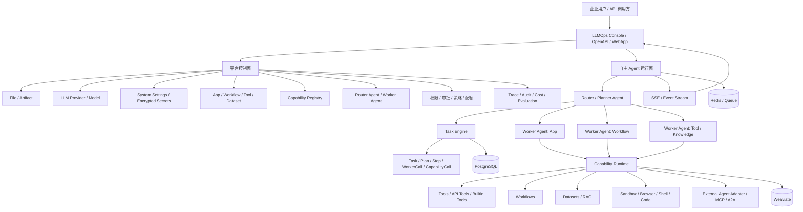

# LLMOps 企业级自主多 Agent 平台总体计划

本文档描述基于现有 `llmops` 演进为“企业级可控自主多 Agent 平台”的总体方案。本文已经合并最新判断：先改造 `llmops` 的平台基础，再实现自主 Router/Worker Runtime；现有 App 可先作为 Worker Agent 接入；A2A/MCP 应作为外部 Agent/工具接入适配层，而不是平台内部第一优先级协议。

## 1. 总体判断

`llmops` 当前更适合作为企业 Agent 平台底座，而不是直接作为自主 Agent Runtime。

它已经具备企业平台控制面雏形：

- 账号、API Key、租户上下文。
- App、Workflow、Tool、Dataset 等核心资产。
- Vue 控制台、可视化工作流、应用调试、发布渠道。
- PostgreSQL、Redis、Celery、Weaviate 基础设施。
- Router/Worker Agent、Task、Plan、Step、Trace 等平台化数据模型雏形。

但它还缺少真正的主动智能体运行面：

- `Router/Worker Agent` 已有模型和接口，但实际 Worker 执行仍回落到 `AppService.debug_chat()`。
- `WorkerRuntime` 仍是 placeholder。
- Router 计划当前偏规则生成，不是 LLM 驱动的自主规划。
- App Agent 能调用工具、工作流、知识库，但不是面向复杂任务的动态规划执行引擎。

推荐演进方向：

```text
llmops = 企业 Agent 平台控制面
autonomous runtime = 主动规划、多 Agent 执行、任务治理运行面
```

不要简单把 `agentic` 复制进 `llmops`。正确做法是把 `agentic` 的 Planner/ReAct/工具执行/沙箱/事件流思想吸收到 `llmops` 的平台模型里。专项设计见 `llmops-agentic-runtime-design.md`。

## 2. 最新路线修正

这次讨论后，计划顺序需要明确调整：

```text
错误顺序：
先做 A2A / 自主 Router -> 再补平台基础

推荐顺序：
先补 llmops 平台基础 -> 现有 App 适配 Worker -> 内部 Router/Worker 协议 -> 自主规划执行 -> A2A/MCP 外部接入
```

原因：

- 企业交付首先需要稳定的平台底座，而不是先追求“看起来很自主”的 Demo。
- Router/Worker 的边界必须先在平台内部跑通，再考虑 A2A。
- 文件、模型、密钥、能力注册是 Agent 页面和 Worker 执行的前置条件。
- 现有 App 是最自然的第一类 Worker，应先适配成平台内部 Worker。
- A2A 更适合作为外部 Agent 接入协议，而不是内部核心协议。

## 3. 产品定位

目标产品定位：

> 面向企业的可控自主多 Agent 平台。平台既能管理模型、密钥、文件、工具、工作流、知识库和应用，也能让 Router Agent 主动规划任务、调度多个专业 Worker Agent、调用企业能力并交付可审计结果。

核心差异化：

- 不是单纯聊天机器人。
- 不是单纯工作流平台。
- 不是不可控的黑箱 Agent。
- 是“平台资产管理 + 可控自主执行 + 多 Agent 协作 + 企业治理”的 Agent 平台。

对标方向可以参考 Dify 的平台化体验，但要增强主动规划和多 Agent 协作能力。

## 4. 目标架构

目标架构分为控制面和运行面。



## 5. Router Agent 与 Worker Agent 边界

必须先划清 Router 和 Worker 的职责边界。

### 5.1 Router Agent 职责

Router Agent 负责全局任务控制：

- 理解用户目标。
- 选择合适 Worker。
- 生成计划。
- 拆分步骤和依赖。
- 监听 Worker 执行结果。
- 判断是否需要重规划。
- 汇总最终结果。
- 触发审批或请求用户补充信息。
- 控制任务状态、失败策略、超时和取消。

Router 不应该直接执行业务工具，也不应该直接操作知识库或外部系统。它应该通过 Worker 或 Capability Runtime 调用能力。

### 5.2 Worker Agent 职责

Worker Agent 负责专业子任务执行：

- 接收一个明确子任务。
- 使用自己的模型、提示词、工具、工作流、知识库、文件上下文完成任务。
- 返回结构化结果、证据、产物、错误。
- 不负责全局规划。
- 不直接调度其他 Worker。

### 5.3 现有 App 作为 Worker Agent

现有 `llmops` App 可以先适配为 Worker Agent：

```text
App
  -> AppWorkerAdapter
  -> WorkerAgent
  -> WorkerRuntime.invoke()
  -> WorkerResult
```

短期可以复用 App 的模型、prompt、tools、workflows、datasets 配置；长期应避免 Router 直接调用 `AppService.debug_chat()`，而是通过统一 Worker 协议调用。

## 6. A2A 的位置

A2A 不建议作为第一阶段内部核心协议。

推荐内部先定义稳定协议：

```text
WorkerInvocation
WorkerResult
AgentEvent
ArtifactRef
CapabilityCall
```

后续再做适配：

```text
Internal Worker Protocol <-> A2A Protocol
Internal Worker Protocol <-> MCP Tool
Internal Worker Protocol <-> External Agent API
```

这样平台不会被某个外部协议绑死，也更利于企业私有系统接入。

## 7. 平台基础改造

在做自主 Router 之前，`llmops` 需要先补齐几类基础能力。

## 7.1 文件上传与文件资产

企业 Agent 平台需要把文件作为一等资产，而不是只作为上传附件。

需要支持：

- 文件上传。
- 文件预览。
- 文件解析。
- 文件作为任务输入。
- 文件作为知识库文档来源。
- 文件作为 Agent 产物。
- Worker 之间通过 `ArtifactRef` 传递文件。

建议区分三类对象：

| 对象 | 说明 |
| --- | --- |
| `UploadFile` | 用户上传的原始文件 |
| `Artifact` | Agent 任务过程中产生的文件、报告、表格、图片、结果包 |
| `DatasetDocument` | 进入知识库索引的文档 |

文件不要在 Worker 之间直接传二进制，应传递引用：

```json
{
  "artifact_id": "uuid",
  "type": "file",
  "name": "report.md",
  "mime_type": "text/markdown",
  "storage_url": "...",
  "created_by_step_id": "step_2"
}
```

## 7.2 LLM 管理

当前项目已有模型 provider YAML 和环境变量配置，但企业平台需要独立模型管理页面。

需要支持：

- Provider 管理：OpenAI、DeepSeek、通义、月之暗面、Ollama、私有模型等。
- Model 管理：模型名、上下文窗口、输出上限、能力标签、价格、默认参数。
- 默认模型配置。
- 第一阶段按 `account_id` 隔离，系统级/租户级可见范围留到企业权限阶段。
- 模型能力标记：`tool_call`、`vision`、`agent_thought`、`embedding`、`rerank`。
- 模型健康检查。

Agent 页面不应要求用户手动输入 API Key，只选择已配置的模型。

## 7.3 系统设置与敏感配置

第一阶段不单独建立 `CredentialVault` 表，也不引入 `scope_type / scope_id / version`。当前 `llmops` 主线资源主要使用 `account_id` 隔离，因此配置底座先跟随主线，新增账号级 setting 表。

建议基础表：

```text
account_settings

- id
- account_id
- category      # storage / llm_provider / upload / agent / tool
- key           # local / qcloud_cos / aliyun_oss / openai / default
- value         # JSON，完整配置对象，敏感字段保存密文
- enabled
- created_at
- updated_at
```

唯一索引：

```text
unique(account_id, category, key)
```

敏感字段由 API/service 层按配置类型处理：

```text
管理 API 入参
  -> 根据 category/key 识别敏感字段
  -> 加密后写入 account_settings.value

管理 API 读取
  -> 普通字段正常返回
  -> 敏感字段只返回脱敏值

运行时读取
  -> SettingService 读取配置
  -> 对指定字段解密
  -> 注入 Storage / LLM / Tool Runtime
```

配置读取优先级：

1. 优先读取 `account_settings`。
2. 未配置时回退到现有 `.env / Settings`。
3. 后续企业版再补 `tenant_settings`、`system_settings` 或配置继承。

页面可以叫“系统设置”或“配置管理”，但底层第一阶段保持 `account_id` 隔离，避免提前扩展出完整多租户配置体系。

## 7.4 Capability Registry

Capability Registry 是 Router/Worker 能跑起来的关键。

平台中所有可调用能力都应统一登记：

- Builtin Tool。
- API Tool。
- Workflow。
- Dataset Retrieval。
- App Worker。
- External Agent。
- Sandbox Skill。
- HTTP API。

统一描述：

```json
{
  "name": "contract_review_worker",
  "kind": "worker_agent",
  "description": "审查合同风险并输出修改建议",
  "input_schema": {},
  "output_schema": {},
  "risk_level": "medium",
  "target_ref_type": "app",
  "target_ref_id": "uuid",
  "setting_ref": "category/key-or-empty"
}
```

Router 看到的是 capability，而不是散乱的 App、工具、工作流对象。

## 7.5 Agent 页面

Agent 页面要明确区分 Router Agent 和 Worker Agent。

建议结构：

```text
Agent 管理
├── Router Agents
│   ├── 绑定 Worker
│   ├── 配置规划模型
│   ├── 配置执行策略
│   ├── 配置审批规则
│   └── 调试复杂任务
└── Worker Agents
    ├── 从 App 创建
    ├── 从 Workflow 创建
    ├── 绑定工具
    ├── 绑定知识库
    ├── 配置模型和提示词
    └── 配置文件输入/产物输出
```

Worker Agent 可以先从现有 App 创建，后续再支持从 Workflow、Tool Set、外部 Agent 创建。

## 8. 内部协议

内部协议先于 A2A。

### 8.1 WorkerInvocation

```json
{
  "schema_version": "worker_invocation_v1",
  "trace_id": "string",
  "account_id": "uuid",
  "task_id": "uuid",
  "plan_id": "uuid",
  "step_id": "uuid",
  "router_id": "uuid",
  "worker_id": "uuid",
  "user": {},
  "task": {
    "title": "string",
    "instruction": "string"
  },
  "context": {
    "variables": {},
    "artifacts": []
  },
  "execution_policy": {
    "timeout_seconds": 120,
    "max_iterations": 5
  }
}
```

### 8.2 WorkerResult

```json
{
  "schema_version": "worker_result_v1",
  "trace_id": "string",
  "task_id": "uuid",
  "step_id": "uuid",
  "worker_id": "uuid",
  "status": "succeeded",
  "summary": "string",
  "data": {},
  "evidence": [],
  "artifacts": [],
  "actions": [],
  "confidence": 0.86,
  "retryable": false,
  "error_code": "",
  "errors": [],
  "used_capabilities": []
}
```

### 8.3 AgentEvent

统一事件流建议：

| 事件 | 说明 |
| --- | --- |
| `task_created` | 任务创建 |
| `planning_started` | 开始规划 |
| `plan_created` | 计划生成 |
| `plan_updated` | 计划更新 |
| `step_started` | 步骤开始 |
| `worker_started` | Worker 开始 |
| `capability_call_started` | 能力调用开始 |
| `capability_call_completed` | 能力调用完成 |
| `artifact_created` | 产物生成 |
| `approval_required` | 需要审批 |
| `user_input_required` | 需要用户补充输入 |
| `step_completed` | 步骤完成 |
| `step_failed` | 步骤失败 |
| `task_completed` | 任务完成 |
| `task_failed` | 任务失败 |
| `task_cancelled` | 任务取消 |

## 9. 分阶段实施计划

## Phase 0：基线整理与边界确认

目标：明确新平台的职责边界和改造范围，并清理不进入当前主线的实验性 tenant/RBAC 脚手架。

周期建议：1-2 周。

主要任务：

- 梳理现有 App、Workflow、Tool、Dataset、Router Agent、Task Engine 的代码边界。
- 明确 `AppService._run_debug_agent()` 只保留 App 调试、WebApp、OpenAPI、Assistant Agent 等现有对话职责。
- 明确新增 `AutonomousAgentRuntime` 的职责：复杂任务规划、多 Worker 执行、动态重规划。
- 明确内部协议先于 A2A。
- 明确现有 App 第一阶段适配为 Worker Agent。
- 定义文件、模型、敏感配置、Capability、Agent 页面改造范围。
- 梳理现有 `Tenant`、`TenantMember`、RBAC、Router Agent、Task、Trace、Approval 代码的实际使用范围。
- 对未形成主线业务闭环的 tenant/RBAC 代码，优先从主 API 中移除或隔离。
- 对 AgentTask、Trace、Approval 等后续仍有价值的运行面概念，只保留设计参考，后续按 `account_id` 和新的 Agent Runtime 边界重新落地。

交付物：

- 自主 Agent Runtime 设计文档。
- Router/Worker 边界文档。
- 内部 Worker 协议草案。
- Capability Registry 设计草案。
- 文件/敏感配置/模型管理改造草案。
- tenant/RBAC/实验性 Agent Runtime 清理清单。

验收标准：

- 不破坏现有 App、Workflow、Tool、Dataset 功能。
- 明确哪些代码复用、哪些代码新增、哪些代码逐步替换。
- 主线代码中不再暴露半成品 tenant/RBAC 接口，后续实施以 `account_id` 为当前隔离边界。

## Phase 1：LLMOps 平台基础改造

目标：先把 `llmops` 改造成企业 Agent 平台底座，为后续自主 Agent Runtime 提供稳定资产层。

周期建议：3-5 周。

当前状态（2026-06-02）：

- 1-4 平台底座 MVP 已完成，可进入 Agent 前置和 Runtime 工作。
- Setting、Storage 配置、LLM Provider/Model、Files 类网盘管理已落地。
- Files 已支持分页、目录树、批量移动/删除、知识库来源；下一步重点是 Agent 输入文件、Artifact 登记和 `ArtifactRef`。
- LLM Provider 已支持账号级密钥加密、脱敏展示、系统 YAML 真实模型同步，Agent 页面后续应只选择模型，不直接填写密钥。
- `agentic` 接入方式已明确：`llmops` 负责平台控制面和运行治理，`agentic` 的 Planner/ReAct 思想作为 PlannerAgent、ReActWorkerAgent 和事件流能力来源。

主要任务：

### 1. 文件与 Artifact

- 完善文件上传和预览。
- 明确 UploadFile、DatasetDocument、Artifact 的边界。
- 支持任务输入文件。
- 支持任务产物登记。
- 支持 Artifact 在步骤之间传递。

### 2. LLM Provider / Model 管理

- 新增模型管理页面。
- 支持 provider、model、能力标签、默认参数、价格、上下文窗口。
- 第一阶段按 `account_id` 管理 provider/model 配置。
- Agent 页面只选择模型，不填写密钥。

### 3. 系统设置与敏感配置

- 新增 `account_settings` 表。
- 支持 storage、LLM provider、工具等配置。
- 由 API/service 层识别敏感字段并加密保存。
- 管理页面只脱敏展示敏感字段。
- 运行时通过 `SettingService` 解密后注入 Storage / LLM / Tool Runtime。
- 未配置 DB setting 时回退到现有 `.env / Settings`。

### 4. Capability Registry

- 将 Tool、Workflow、Dataset Retrieval、App Worker 统一登记为 Capability。
- 为 Router 提供可用能力列表。
- 每个 Capability 带 input/output schema、risk level、permission scope。

### 5. Agent 页面拆分

- 新增 Router Agent 列表/详情。
- 新增 Worker Agent 列表/详情。
- 支持从现有 App 创建 Worker Agent。
- Router Agent 支持绑定 Worker。

交付物：

- 文件与 Artifact 基础模型。
- LLM 管理页面。
- 系统设置与敏感配置管理页面。
- Capability Registry 第一版。
- Router/Worker Agent 页面雏形。

验收标准：

- 用户能在平台配置模型、存储和敏感参数。
- Agent 配置页可以直接选择模型、工具、知识库和已配置能力。
- 现有 App 能作为 Worker Agent 被登记和选择。

## Phase 2：现有 App 适配 Worker Agent

目标：把现有 App 作为第一类 Worker Agent 接入内部 Worker 协议。

周期建议：2-4 周。

主要任务：

- 实现 `AppWorkerAdapter`。
- 实现 `WorkerRuntime.invoke()` 最小版本。
- 输入使用 `WorkerInvocation`。
- 输出使用 `WorkerResult`。
- 保留 App 原有模型、工具、工作流、知识库配置。
- 支持文件上下文和 Artifact 输出。
- 将 Worker 执行过程转换为统一 AgentEvent。
- 不再让 Router 直接依赖 `AppService.debug_chat()` 的 SSE 字符串格式。

交付物：

- `App -> WorkerAgent` 转换链路。
- `WorkerRuntime` 第一版。
- Worker 调用记录落库。
- Worker 事件流。

验收标准：

- Router 或测试 API 可以用统一协议调用一个 App Worker。
- WorkerResult 结构化返回结果、证据、产物和错误。
- 过程可追踪到 WorkerCall。

## Phase 3：自主 Router Agent MVP

目标：实现可演示、可持久化、可观测的主动 Agent 任务执行闭环。

周期建议：3-5 周。

主要任务：

### 1. Planner Agent

实现 `PlannerAgent`：

- 输入用户目标、上下文、可用 Worker/Capability。
- 输出结构化计划。
- 每个步骤包含 `step_id`、`title`、`description`、`worker_id`、`dependencies`、`expected_output`、`risk_level`。
- 支持计划失败时返回错误原因。

第一版可以要求模型输出 JSON，并使用 Pydantic 校验和修复。

### 2. Task Engine 接入

复用并增强现有 `TaskEngineService`：

- 创建任务。
- 保存计划。
- 保存步骤。
- 保存 WorkerCall。
- 保存 CapabilityCall。
- 记录失败、重试、取消、完成。

### 3. Agent Task API

新增接口：

- 创建自主任务。
- 查询任务列表。
- 查询任务详情。
- 订阅任务 SSE。
- 停止任务。
- 继续任务。

### 4. 前端任务执行台

新增页面：

```text
ui/src/views/space/agent-tasks/
├── ListView.vue
├── DetailView.vue
├── components/PlanPanel.vue
├── components/StepTimeline.vue
├── components/WorkerCallPanel.vue
├── components/CapabilityCallPanel.vue
└── components/ArtifactPanel.vue
```

交付物：

- Router Planner MVP。
- Agent Task API。
- Task Event SSE。
- 前端任务执行台。
- 1 个企业 Demo 场景。

验收标准：

- 用户提交复杂任务后，系统能主动生成计划。
- 系统能调用至少一个 App Worker 完成子任务。
- 前端能实时展示计划、步骤、Worker 调用和最终结果。
- 任务过程完整落库。

## Phase 4：多 Agent 协作与动态重规划

目标：从“单轮计划 + 顺序执行”升级为“多 Worker 协作 + 结果驱动重规划”。

周期建议：4-6 周。

主要任务：

### 1. Router Agent 增强

- 根据任务自动选择 Worker。
- 根据 Worker 能力、历史表现、权限和成本做路由。
- 支持指定 Worker 和自动 Worker 混合模式。

### 2. 动态重规划

Planner 在步骤执行后判断：

- 是否完成目标。
- 是否需要追加步骤。
- 是否需要替换 Worker。
- 是否需要请求用户补充信息。
- 是否需要进入人工审批。

### 3. 并行与依赖执行

增强 Task Engine：

- 支持 DAG step dependencies。
- 支持无依赖步骤并行。
- 支持步骤超时、重试、跳过。
- 支持步骤级失败策略。

### 4. 上下文与产物传递

- Worker 输出成为后续步骤输入。
- 文件、表格、报告、图片等产物登记到任务。
- 最终结果可以引用中间产物和证据。

交付物：

- 多 Worker 自动选择。
- 动态重规划。
- 并行执行。
- Artifact 管理。
- Human-in-the-loop 输入。

验收标准：

- 一个任务可由多个 Worker 按依赖顺序或并行完成。
- 执行失败时系统能自动调整计划或明确失败原因。
- 任务最终结果能引用中间产物和证据。

## Phase 5：企业级治理、外部接入与产品化

目标：把自主 Agent 从 Demo 能力升级为企业可交付能力。

周期建议：持续迭代。

主要任务：

### 1. 权限与租户隔离

- 完善租户、成员、角色、资源权限。
- App、Workflow、Tool、Dataset、Capability、Setting、Agent 按租户隔离。
- Worker 可见性和可调用范围可配置。

### 2. 审批与策略

审批触发条件：

- 高风险工具调用。
- 外部系统写操作。
- 金额、合同、审批流、生产变更等敏感动作。
- 大批量数据导出。

策略能力：

- 工具白名单/黑名单。
- 最大执行时长。
- 最大步骤数。
- 最大模型调用次数。
- 最大成本。
- 数据脱敏。

### 3. 沙箱隔离

如果平台要支持代码执行、浏览器、Shell、文件处理，应引入沙箱：

- 每个任务独立执行环境。
- 文件和网络权限可控。
- 超时自动销毁。
- 产物可回收。
- 日志可审计。

可参考 `agentic` 的 sandbox 思路，但应按企业平台权限和任务模型重新封装。

### 4. 外部 Agent / A2A / MCP

在内部 Router/Worker 协议稳定后，再接入：

- MCP 工具。
- A2A Agent。
- 企业内部 Agent API。
- 第三方 Agent 服务。

这些都应作为 External Capability 或 External Worker Adapter。

### 5. 审计、观测、成本

需要提供：

- Trace 时间线。
- Worker 调用记录。
- Capability 调用记录。
- 输入输出审计。
- Token 和成本统计。
- 错误分布。
- 用户满意度和效果评估。

### 6. 企业交付

需要形成：

- Docker Compose 私有化部署。
- Kubernetes 部署方案。
- 离线模型或私有模型接入。
- 日志和监控。
- 备份恢复。
- 灰度升级。
- 环境变量和密钥管理规范。
- 管理员手册和用户手册。

验收标准：

- 高风险动作不能绕过审批。
- 租户间数据不可互访。
- 每个任务可完整追踪、复盘和导出审计记录。
- 企业客户可以完成部署、初始化、接入模型、接入知识库、创建 Agent 并运行第一个任务。

## 10. 建议新增模块

后端建议新增：

```text
api/app/domain/autonomous_agent/
├── entities.py
├── events.py
├── planner_agent.py
├── router_agent.py
├── worker_runtime.py
├── app_worker_adapter.py
├── capability_runtime.py
├── runtime.py
├── prompts.py
└── policies.py

api/app/services/
├── autonomous_agent_service.py
├── capability_registry_service.py
├── setting_service.py
├── artifact_service.py
├── model_provider_service.py
└── agent_event_service.py

api/app/api/routers/
├── agent_task.py
├── setting.py
├── capability.py
└── model_provider.py
```

前端建议新增：

```text
ui/src/views/space/agent-tasks/
├── ListView.vue
├── DetailView.vue
└── components/

ui/src/views/space/agents/
├── RouterAgentListView.vue
├── RouterAgentDetailView.vue
├── WorkerAgentListView.vue
└── WorkerAgentDetailView.vue

ui/src/views/space/settings/
ui/src/views/space/model-providers/

ui/src/services/agent-task.ts
ui/src/services/setting.ts
ui/src/services/capability.ts
ui/src/services/model-provider.ts

ui/src/hooks/use-agent-task.ts
ui/src/hooks/use-setting.ts
ui/src/hooks/use-capability.ts
ui/src/hooks/use-model-provider.ts
```

数据库建议演进：

- 复用 `agent_tasks`、`agent_plans`、`agent_steps`、`worker_calls`、`capability_calls`。
- 新增或扩展 `agent_events`。
- 新增 `artifacts`。
- 新增 `capabilities` 或完善现有 capability 表。
- 新增 `account_settings`，敏感字段由 service 层加密处理。
- 新增 `model_providers` / `models`。
- 新增 `agent_policies`。

## 11. MVP 场景建议

第一版不要做泛化过强的“万能 Agent”，应选择 1-2 个高价值、可控、可演示场景。

### 场景 A：经营分析 Agent

输入：

> 分析本月销售数据，找出利润下降原因，并生成一份管理层报告。

需要能力：

- 文件上传和解析。
- 数据计算。
- 知识库查询经营口径。
- 图表或 Markdown 报告生成。
- 多步骤计划。
- Artifact 输出。

适合验证：

- 文件资产。
- Planner。
- App Worker。
- 产物生成。
- 前端过程展示。

### 场景 B：合同审查 Agent

输入：

> 审查这份采购合同，找出风险条款，并给出修改建议。

需要能力：

- 文档解析。
- 知识库检索合同规则。
- 条款风险分类。
- 输出审查报告。
- 高风险结论人工确认。

适合验证：

- 知识库召回。
- Worker Agent。
- 审批/人工介入。
- 审计留痕。

### 场景 C：IT 运维诊断 Agent

输入：

> 线上服务响应变慢，请诊断原因并给出处置建议。

需要能力：

- 调用监控 API。
- 查询日志。
- 多 Worker 分析。
- 输出根因和操作建议。
- 生产变更前审批。

适合验证：

- API 工具。
- 敏感配置管理。
- 高风险动作策略。
- 多 Agent 协作。

## 12. 主要风险

### 技术风险

- 自主规划不稳定，计划 JSON 可能不符合 schema。
- 工具调用失败会导致任务链路中断。
- 多 Agent 上下文膨胀，成本和延迟上升。
- 进程内状态无法支撑多副本部署。
- 代码执行和 Shell 执行存在安全风险。

应对：

- Pydantic schema 校验和修复。
- 明确失败策略和重试策略。
- 引入上下文压缩和产物引用。
- 任务状态全部落库，运行状态可恢复。
- 高风险能力必须沙箱化和审批化。

### 产品风险

- 如果过度强调“全自主”，企业客户会担心不可控。
- 如果只做工作流，则难以体现 Agent 平台差异化。
- 如果第一版场景太泛，会导致 Demo 不稳定。

应对：

- 定位为“可控自主”。
- 第一版聚焦具体企业场景。
- 把过程可见、权限可控、审计完整作为卖点。

### 交付风险

- 企业私有化环境模型、网络、数据源差异大。
- API 凭证和权限管理复杂。
- 客户场景需要定制集成。

应对：

- 提供标准适配器和模板。
- 建立工具接入规范。
- 提供部署检查脚本和运维手册。

## 13. 近期行动清单

建议最近一个迭代从 Agent 前置开始，不直接做 A2A。

1. 明确 Router Agent / Worker Agent 边界。
2. 设计内部 `WorkerInvocation` / `WorkerResult` / `AgentEvent` 协议。
3. 落地文件作为 Agent task 输入。后端 Runtime 已完成，任务页 UI 待产品化。
4. 落地 Agent 产物 Artifact 登记和 `ArtifactRef`。后端 Runtime 已完成文本产物和已有 file_id 引用闭环，完整二进制/sandbox 产物待产品化。
5. 设计 Capability Registry 第一版。
6. 实现从现有 App 创建 Worker Agent。
7. 新增 Router/Worker Agent 页面雏形。
8. 实现 `WorkerRuntime` 调用 App Worker。
9. 将 Worker 执行过程转换为统一 AgentEvent。
10. 启动 Router Planner MVP。

已完成的基础项：

- LLM Provider / Model 管理页面。
- 系统设置页面、`account_settings` 表和敏感字段加密处理。
- Files 文件资产管理基础能力。
- Agent 输入文件后端接入：`input_file_ids` 会进入 `WorkerInvocation.context.input_files`。
- ArtifactRef 后端接入：`WorkerResult.artifacts` 可登记 `files.source=agent` 文本产物，并传递给后续 step。

## 14. 最终目标

最终平台应具备以下能力：

- 企业用户可以创建多个专业 Worker Agent。
- Router Agent 可以主动规划任务并选择 Worker。
- Worker 可以调用工具、工作流、知识库、沙箱和外部 Agent。
- Agent 页面可以直接选择模型、工具、知识库、文件能力和已配置参数。
- 敏感配置由平台加密托管，Agent 运行时只通过服务层解析使用。
- 文件可作为输入、知识库来源和任务产物流转。
- 任务过程可实时展示、可暂停、可审批、可恢复、可审计。
- 平台支持私有化部署、多租户隔离、权限控制和成本观测。
- 企业可以基于模板快速构建自己的业务 Agent。

这条路线的关键不是让 Agent “看起来很聪明”，而是让它在企业环境里“聪明且可控”。只有先把平台底座做稳，再接入自主规划和外部 Agent 协议，才有可能真正交付给企业。
